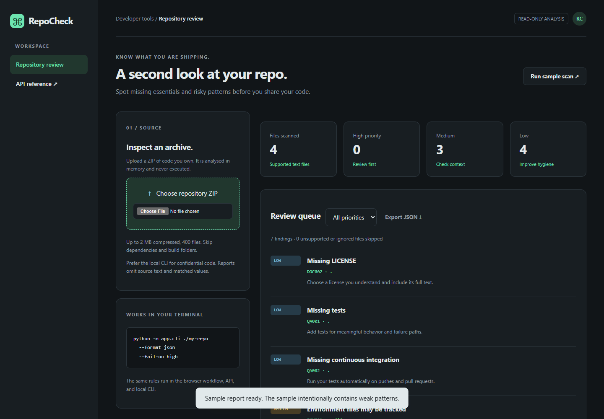

# RepoCheck

A defensive repository hygiene checker with a reusable Python engine, local CLI and HTTP API.

**Status:** local implementation verified. **Live demo:** deployment pending.

[Quick start](#run-locally) · [Engineering decisions](#engineering-decisions) · [Code walkthrough](docs/EXPLAINED.md) · [Mobile preview](docs/screenshot-mobile.png)



## Features

- Inspect a source ZIP in the browser or scan a local directory from the command line.
- Check for missing README, license, tests, CI and environment-file exclusions.
- Flag selected risky patterns such as possible hardcoded credentials, dynamic evaluation and disabled TLS verification.
- See severity, rule ID, path, line and remediation, with matched source values omitted.
- Export JSON and use CLI exit codes in continuous integration.
- No repository fetching, code execution, archive extraction or saved server-side source files.

## Engineering decisions

One scanning engine, two entry points.

| Decision | Reason |
| --- | --- |
| Shared rules | The CLI and HTTP API use the same scanner so rule behavior can be maintained in one place. |
| Bounded ZIP inspection | Entry counts, paths, file sizes and compression ratios are checked without extracting or executing source. |
| Reports omit matched values | Findings identify the rule, severity, location and suggested fix without repeating possible secret values. |
| Explicit heuristic limits | Pattern matches can produce false positives and miss real issues; they are review prompts, not security certification. |

**Recorded local verification:** 5 passing backend tests, plus browser and mobile checks. [Test output](docs/test-results.txt). Hosted CI and deployment checks are still pending.

## Tech stack

Python, FastAPI, standard-library ZIP processing, HTML, CSS, JavaScript

## Run locally

Use Python 3.12. From this repository's folder:

```powershell
python -m venv .venv
.venv\Scripts\python -m pip install -r requirements-dev.txt
.venv\Scripts\python -m uvicorn app.main:app --reload --host 127.0.0.1 --port 8000
```

On macOS/Linux, replace `.venv\Scripts\python` with `.venv/bin/python`.
Open **http://127.0.0.1:8000**. Interactive API documentation is at **/docs**, and **/healthz** is the health check.

`.env.example` documents configuration names. The application reads environment variables; it does **not** automatically load a `.env` file. Set variables in your shell or hosting dashboard. Never commit real `.env` values.

## Test

```powershell
.venv\Scripts\python -m pytest -q
```

The included GitHub Actions workflow is configured to run these tests on pushes and pull requests; a hosted run has not yet been verified. Direct dependencies are pinned to the versions tested for this release.

## Deploy

`render.yaml` describes a Render Python web service with one worker. Connect the eventual GitHub repository and review the service settings before creating it. The manifest requests the free web-service plan and does not create paid resources. Availability and provider terms should be checked at deployment time. Deployment has not been performed.

Alternatively, build the included Dockerfile and run the container with the required environment variables. Production traffic should be served over HTTPS.

### Local CLI

```powershell
.venv\Scripts\python -m app.cli C:\path\to\your-repo --format json --fail-on high
```

The CLI uses only Python's standard library; API packages are unnecessary for CLI-only use. Exit code 0 means no findings at the chosen threshold, 1 means the threshold was reached, and 2 means invalid arguments or input. `--fail-on never` always allows findings without failing the command.

### API

- POST /api/scan: JSON mapping under `files`, with relative filenames as keys and text as values.
- POST /api/scan-zip: raw application/zip body, not multipart.
- GET /api/sample: deliberately imperfect sample; it is never executed.

### Limits and interpretation

Maximum archive size: 2 MB. Up to 400 archive entries, 150 KB per supported file, 6 MB total inspected uncompressed data, and a 100:1 compression ratio ceiling. Paths, duplicate names, symlinks and unsupported formats are checked. Git metadata, dependencies and build directories are ignored. There is no archive extraction. Source is not deliberately persisted by the API; prefer the local CLI for confidential repositories.

This is a heuristic checker, not a complete secret detector, vulnerability scanner or security certification. Regex findings can flag safe test fixtures and miss real problems. Review them in context. The `.gitignore` check is intentionally simple and does not fully evaluate Git's pattern rules. Reports omit snippets and matched values but include paths, which can themselves be sensitive.

## Understand the code

Read [docs/EXPLAINED.md](docs/EXPLAINED.md) for the request flow, technology choices, limitations and ten interview questions with answers.

## Attribution and license

Original application code created for Vishnu R. Nair with AI assistance. Third-party libraries retain their licenses. The project is an AI-assisted learning build; the owner is working through the implementation. MIT license; see [LICENSE](LICENSE).
